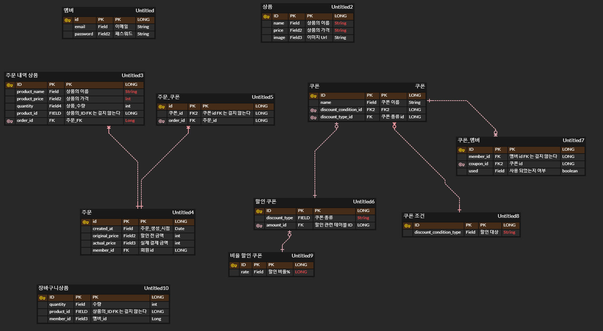

# 2단계 기능 목록 작성

- [ ] swagger 적용

- [x] 테이블 설계

- [ ] 도메인 설계
    - [ ] 회원
    - [ ] 상품
    - [ ] 쿠폰
    - [ ] 장바구니
    -
- API 설계
    - 쿠폰
        - [ ] 모든 쿠폰을 조회할 수 있다
        - [ ] 멤버가 가지고 있는 쿠폰을 조회할 수 있다
        - [ ] 멤버가 쿠폰을 발급 받을 수 있다
    - 주문
        - [ ] 사용자는 장바구니에 담긴 상품을 주문할 수 있다
        - [ ] 사용자는 주문 내역을 조회할 수 있다
        - [ ] 특정 주문의 상세 정보를 조회할 수 있다

# 테이블 설계

## 주문

주문 테이블에서 상품을 직접 PK 로 참조하지 않는 이유는 도메인별로 특징에 맞는 db 를 사용할 수 있다는 가정을 가지고 진행했습니다

주문이라는 서비스가 나중에 다른 프로젝트로 분리되면, 주문 테이블에서 상품을 직접 참조하는 것은 불필요한 의존성을 만들게 됩니다

장바구니 상품에서 그냥 ID 만을 참조하지 않는 이유는, 장바구니에 담긴 상품이 삭제되더라도 주문 내역에는 남아있어야 하기 때문입니다

장바구니 상품이 변경되면, 장바구니에는 영향을 주지 않고, 주문시, 예외를 발생시키기 위해서 입니다

예시) 짜장면 3000원을 담았는데, 짬뽕 5000원으로 변경된 경우, 주문 내역이 짬뽕으로 변경되면 이상하다고 생각했습니다
